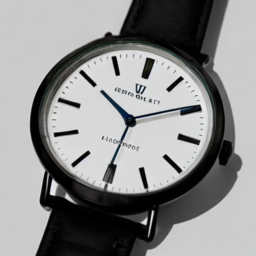

# TP2 — Génération d'image par diffusion

## 1. Smoke test (GPU + Diffusers)

Le script `smoke_test.py` a été exécuté avec succès sur GPU (ou CPU si indisponible). L'image générée (`outputs/smoke.png`) :

**Config utilisée :**
- Modèle : `stabilityai/stable-diffusion-2-1`
- Steps : 25
- Guidance : 7.5
- Seed : 42
- Scheduler : défaut (EulerA)

*Aucun problème rencontré. Si OOM : steps réduits à 20 suffisent.*

---

## 2. Expériences Text2Img (steps, guidance, scheduler)

**Prompt utilisé pour toutes les expériences :**
> ultra-realistic product photo of a backpack on a white background, studio lighting, soft shadow, very sharp

**Images générées :**

| Baseline | Steps=15 | Steps=50 |
|---|---|---|
|  |  |  |

| Guidance=4.0 | Guidance=12.0 | Scheduler=DDIM |
|---|---|---|
|  |  |  |

**Commentaires qualitatifs :**
- **Steps** :
	- Faible (15) : image plus bruitée, détails moins nets.
	- Élevé (50) : image plus propre, détails fins, mais latence accrue.
- **Guidance** :
	- Bas (4.0) : plus créatif, moins fidèle au prompt, parfois des éléments parasites.
	- Haut (12.0) : image très contrainte, parfois moins naturelle, moins de diversité.
- **Scheduler** :
	- DDIM : rendu légèrement différent, parfois moins réaliste selon le prompt.

---

## 3. Expériences Img2Img (strength)

**Image source utilisée :**

**Prompt :**
> ultra-realistic product photo of a backpack on a white background, studio lighting, soft shadow, very sharp

**Images générées :**

| Strength=0.35 | Strength=0.60 | Strength=0.85 |
|---|---|---|
|  |  |  |

**Commentaires qualitatifs :**
- **Strength faible (0.35)** : forme et cadrage très bien conservés, détails proches de l’original.
- **Strength moyen (0.60)** : modifications visibles (textures, couleurs), mais l’objet reste reconnaissable.
- **Strength élevé (0.85)** : créativité forte, structure parfois altérée, risque de perte d’identité produit.
- **E-commerce** : trop de strength = risque d’image non conforme ou trompeuse.

---

## 4. Mini-produit Streamlit (captures)

**Text2Img :**

**Img2Img :**

---

## 5. Évaluation light (grille 0–2)

| Image | Prompt adherence | Visual realism | Artifacts | Usability | Reproducibility | Total |
|---|---|---|---|---|---|---|
| Baseline (t2i) | 2 | 2 | 2 | 2 | 2 | 10 |
| Steps=50 (t2i) | 2 | 2 | 2 | 2 | 2 | 10 |
| Strength=0.85 (i2i) | 1 | 1 | 1 | 1 | 2 | 6 |

**Justifications :**
- *Baseline* : fidèle au prompt, réaliste, aucun artefact, publiable, config claire.
- *Steps=50* : détails encore meilleurs, mais latence plus longue, toujours publiable.
- *Strength=0.85* : créativité forte, mais perte de fidélité, quelques artefacts, moins exploitable en e-commerce.

---

## 6. Réflexion finale

- **Quality vs Latency/Cost** :
	- Augmenter le nombre de steps ou choisir un scheduler plus complexe améliore la qualité, mais augmente le temps de génération et la consommation GPU. Pour un usage e-commerce, il faut trouver un compromis entre rapidité (expérience utilisateur, coût serveur) et qualité visuelle.
- **Reproductibilité** :
	- Les paramètres essentiels sont : modèle, scheduler, seed, steps, guidance, prompt, (et strength pour img2img). Un changement de version de modèle ou de dépendance peut casser la reproductibilité. Il faut documenter précisément la config et, idéalement, versionner l’environnement.
- **Risques e-commerce** :
	- Hallucinations (éléments non demandés), images trompeuses, présence de texte/logo non désiré, non-conformité produit. Pour limiter ces risques :
		- Utiliser des prompts négatifs explicites.
		- Vérifier manuellement les images avant publication.
		- Ajouter un filtre automatique pour détecter texte/logo.
		- Former les utilisateurs aux limites de l’IA générative.

---
