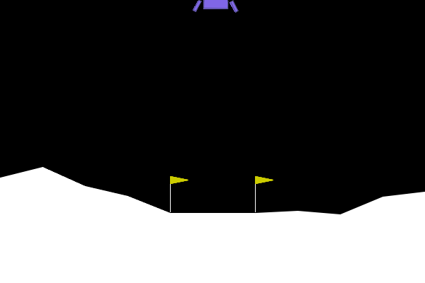

# TP5 : Deep Reinforcement Learning sur LunarLander-v3

# Scripts principaux :
#   - TP5/random_agent.py
#   - TP5/train_and_eval_ppo.py
#   - TP5/reward_hacker.py
#   - TP5/ood_agent.py
# GIFs générés :
#   - TP5/outputs/random_agent.gif
#   - TP5/outputs/trained_ppo_agent.gif
#   - TP5/outputs/hacked_agent.gif
#   - TP5/outputs/ood_agent.gif

## 1. Agent aléatoire

**Résultat** :



```
--- RAPPORT DE VOL ---
Issue du vol : CRASH DÉTECTÉ 💥
Récompense totale cumulée : -174.77 points
Allumages moteur principal : 35
Allumages moteurs latéraux : 54
Durée du vol : 123 frames
Vidéo de la télémétrie sauvegardée sous 'outputs/random_agent.gif'
```

**Analyse** :
L'agent aléatoire est très loin du seuil de +200 points requis pour résoudre l'environnement. Il ne développe aucune stratégie et s'écrase presque systématiquement.

## 2. Agent PPO entraîné

**Résultat** :


```
--- RAPPORT DE VOL PPO ---
Issue du vol : ATTERRISSAGE RÉUSSI 🏆
Récompense totale cumulée : 170.23 points
Allumages moteur principal : 371
Allumages moteurs latéraux : 237
Durée du vol : 679 frames
Vidéo de la télémétrie sauvegardée sous 'outputs/trained_ppo_agent.gif'
```

- Fichier du modèle entraîné : `TP5/ppo_lunar_lander.zip`

**Évolution de ep_rew_mean** :
Au début de l'entraînement, la récompense moyenne par épisode (`ep_rew_mean`) était très négative (autour de -200). Elle a progressivement augmenté pour atteindre environ 170 à la fin, mais n'a pas franchi le seuil de +200 points.

**Comparaison avec l'agent aléatoire** :
L'agent PPO utilise beaucoup plus les moteurs, parvient à se poser, et obtient un score bien supérieur à l'aléatoire, mais il n'atteint pas encore la performance d'un agent "résolvant" l'environnement.

## 3. Reward Hacking (Wrapper pénalité carburant)

**Résultat** :


```
--- RAPPORT DE VOL PPO HACKED ---
Issue du vol : CRASH DÉTECTÉ 💥
Récompense totale cumulée : -102.85 points
Allumages moteur principal : 0
Allumages moteurs latéraux : 4
Durée du vol : 60 frames
Vidéo du nouvel agent sauvegardée sous 'outputs/hacked_agent.gif'
```

**Analyse** :
L'agent a appris à ne jamais utiliser le moteur principal pour éviter la pénalité, ce qui est optimal selon la fonction de récompense modifiée, mais absurde pour la tâche réelle. Il s'écrase rapidement sans utiliser de carburant. Mathématiquement, il maximise la récompense immédiate en évitant la taxe, ignorant l'objectif réel d'atterrissage.

## 4. Robustesse OOD (Gravité lunaire)

**Résultat** :


```
--- RAPPORT DE VOL PPO (GRAVITÉ MODIFIÉE) ---
Issue du vol : TEMPS ÉCOULÉ OU SORTIE DE ZONE ⚠️
Récompense totale cumulée : 86.79 points
Allumages moteur principal : 116
Allumages moteurs latéraux : 707
Durée du vol : 1000 frames
Vidéo de la télémétrie sauvegardée sous 'outputs/ood_agent.gif'
```

**Analyse** :
L'agent n'a pas réussi à se poser calmement sur la lune (gravité faible). Il a utilisé énormément les moteurs latéraux, a survécu longtemps mais n'a pas atterri, ce qui montre un manque de généralisation à la nouvelle physique. Il a surappris la gravité terrestre.

## 5. Stratégies pour la robustesse Sim-to-Real

Pour rendre l'agent robuste à des variations physiques (gravité, vent, etc.) sans multiplier les modèles :

- **Domain Randomization** : Pendant l'entraînement, varier aléatoirement la gravité, le vent, et d'autres paramètres physiques pour forcer l'agent à généraliser.
- **Curriculum Learning** : Commencer l'entraînement sur des environnements simples, puis augmenter progressivement la difficulté (ex : gravité croissante, vents plus forts).
- **Wrappers de perturbation** : Ajouter du bruit ou des perturbations dans l'environnement pour simuler des conditions variées.