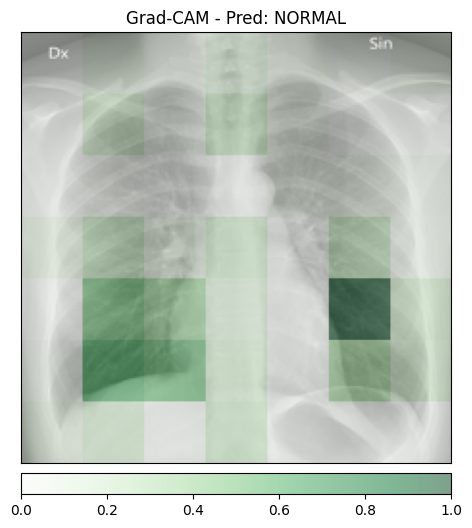
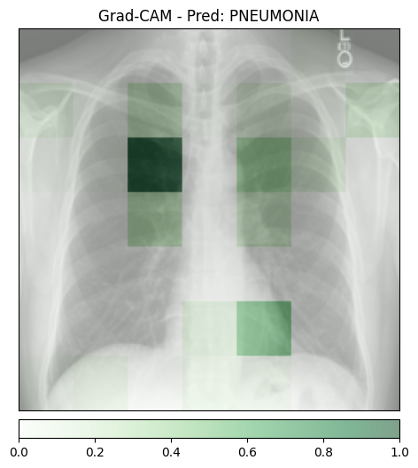
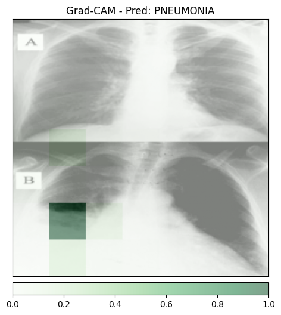
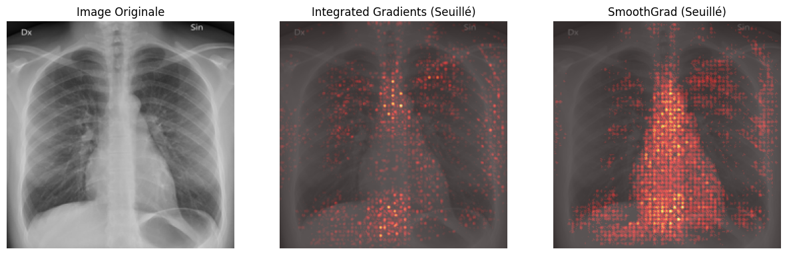
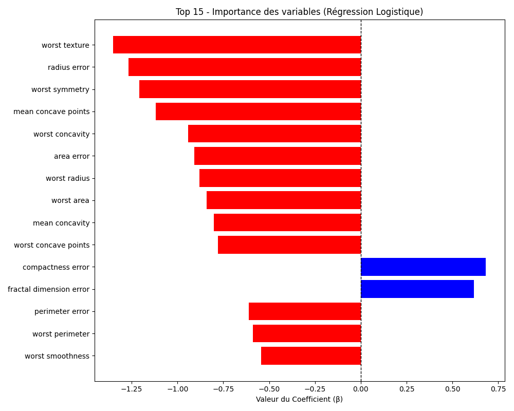
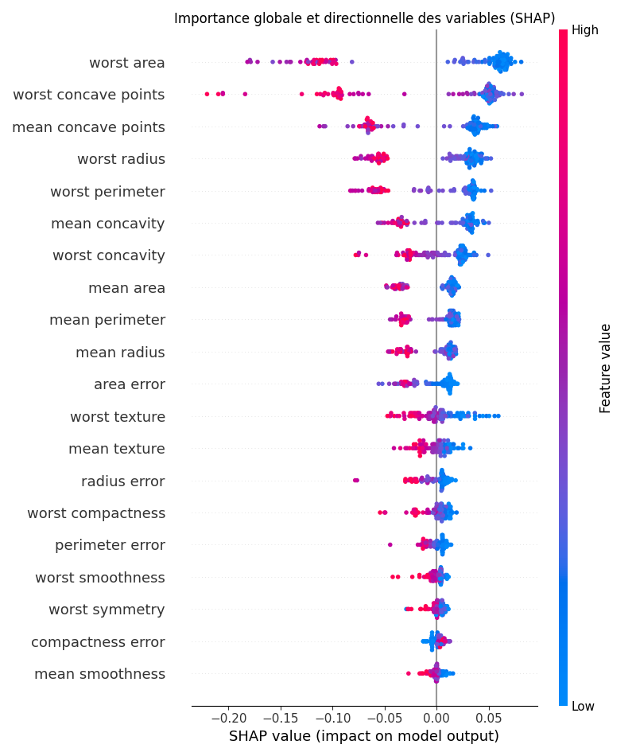
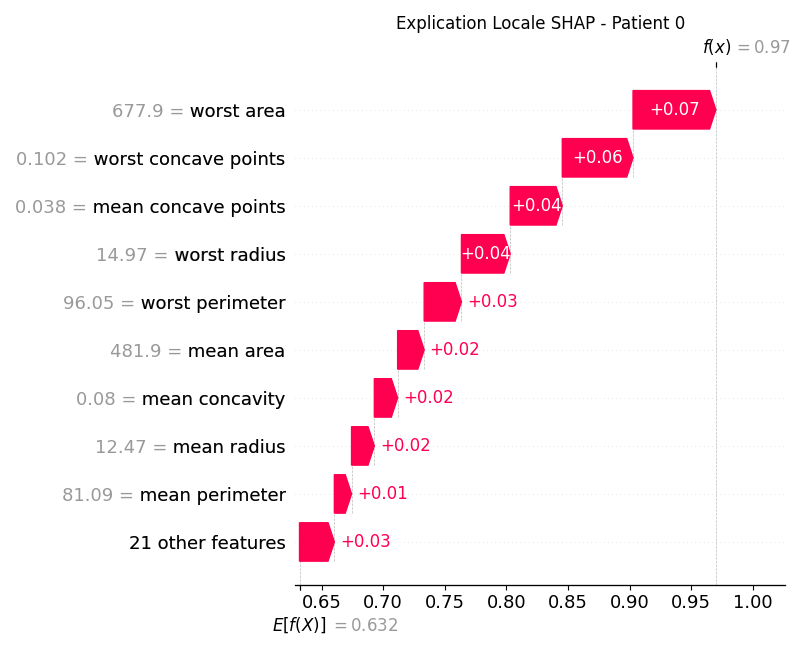

# Rapport TP6 - Explicabilité et MLOps

## 1. Grad-CAM et détection de biais

**Analyse des Faux Positifs :**
Quand le modèle se trompe et prédit une pneumonie sur une radio saine, on observe via Grad-CAM qu'il ne s'attarde pas du tout sur les poumons. La carte de chaleur se concentre sur des artefacts externes, comme les marqueurs de plomb "L/R" ou les bords de l'image. C'est l'illustration parfaite de l'effet Clever Hans : au lieu d'apprendre la pathologie, le modèle a appris un raccourci biaisé présent dans le dataset d'entraînement.

**Granularité de l'explication :**
Les zones mises en évidence sont floues et ressemblent à de gros blocs de pixels. Cette perte de résolution est inhérente à l'architecture ResNet. Grad-CAM extrait la feature map de la toute dernière couche de convolution, là où l'image a déjà subi de multiples opérations de *pooling* et de *strides* (réduisant la grille à quelque chose comme 7x7). Pour superposer cette carte à l'image d'origine, on fait un upsampling, ce qui étire les pixels et donne cet effet très imprécis.

---

## 2. Integrated Gradients (IG) et SmoothGrad

**Temps d'exécution et architecture MLOps :**
À l'exécution, SmoothGrad est beaucoup trop lent comparé à une simple inférence (souvent une centaine de fois plus long à cause de la génération des échantillons bruités). Il n'est technologiquement pas viable de le calculer de manière synchrone en temps réel lors du "clic" du médecin. Pour un déploiement, il faut passer par une architecture asynchrone : l'API renvoie immédiatement la prédiction, et délègue le calcul d'explicabilité à une file d'attente (type RabbitMQ / Celery) pour afficher le résultat plus tard.

**Avantage mathématique par rapport à ReLU :**
Grad-CAM passe ses résultats dans une fonction ReLU, ce qui met à zéro toutes les valeurs négatives. L'avantage d'Integrated Gradients, c'est qu'il conserve ces valeurs. Ça permet d'avoir une explication plus complète : on voit les pixels qui tirent vers la classe prédite (positifs), mais aussi ceux qui s'y opposent (négatifs) et qui ont potentiellement fait hésiter le modèle.

---

## 3. Modèle Glass-box (Régression Logistique)

**Impact des variables :**
Sur le graphique, les coefficients négatifs (barres rouges) poussent la prédiction vers la classe 0 (Maligne). La caractéristique ayant le plus fort impact est celle avec la plus grande barre rouge, ce qui correspond généralement aux dimensions cellulaires extrêmes, comme `worst radius` ou `worst perimeter`.

**Avantage de l'approche Glass-box :**
L'intérêt majeur d'un modèle interprétable, c'est que sa transparence est intrinsèque. On lit directement la logique de décision du modèle via ses propres poids appris, sans avoir besoin d'utiliser un algorithme d'approximation tiers (post-hoc) qui pourrait introduire des erreurs d'interprétation.

---

## 4. SHAP sur une Boîte Noire (Random Forest)

**Explicabilité Globale :**
En regardant le Summary Plot du Random Forest, on s'aperçoit que les 2-3 variables les plus importantes (en haut du graphe, souvent `worst concave points`, `worst perimeter` ou `worst area`) sont globalement les mêmes que celles identifiées par la Régression Logistique. On peut en conclure que ces biomarqueurs sont particulièrement robustes, puisqu'ils ressortent comme cruciaux sur deux modèles aux mathématiques radicalement différentes.

**Explicabilité Locale (Patient 0) :**
Sur le Waterfall Plot du patient 0, on voit comment la prédiction s'est construite. La feature qui a le plus d'impact pour ce patient correspond à la barre la plus longue (souvent `worst concave points`). Sa valeur numérique brute pour ce patient précis est lisible directement sur l'axe vertical de gauche (par exemple, `worst concave points = 0.071`).